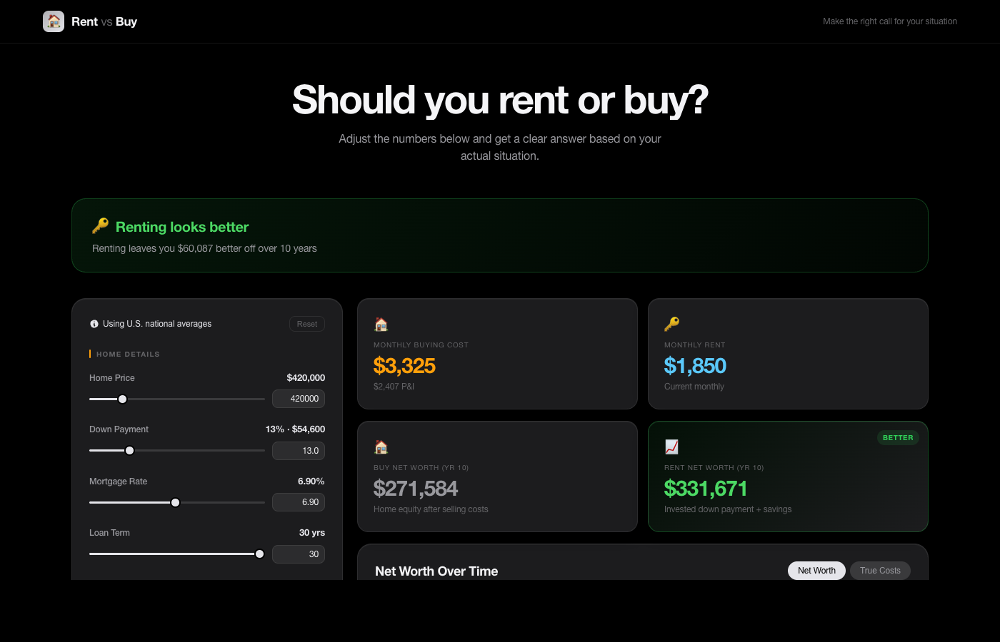

# 🏠 Rent vs Buy Calculator

A calculator that tells you whether renting or buying makes more financial sense given your numbers. Built with React, TypeScript, and Recharts.



---

## Features

**Instant verdict** — A clear recommendation updates live as you adjust any input, showing exactly how much better off you'd be over your chosen time horizon.

**Honest cost comparison** — The "True Costs" chart strips out principal payments (which build equity) so you're only comparing money that's genuinely gone — interest, taxes, insurance, and maintenance vs. rent paid.

**Net worth projection** — Models both paths over time: home equity minus selling costs on the buy side vs. an invested down payment plus saved monthly difference on the rent side.

**Dual input controls** — Every field has both a slider for fast exploration and a text input for precision. Values validate and snap to step increments on blur.

**U.S. national averages pre-loaded** — Defaults are sourced from NAR, Freddie Mac, Zillow, Insurance.com, and the Tax Foundation so you start with a realistic baseline.

**Persistent state** — Your inputs are saved to `localStorage` and restored on refresh. A reset button returns everything to defaults.

---

## Screenshots

### Full dashboard


> Orange = buying · Teal = renting · Green = the recommended option

---

## Getting Started

```bash
npm install
npm run dev
```

Open [http://localhost:5175](http://localhost:5175).

---

## How the Math Works

### Buy path

- Monthly payment = standard amortization formula (P&I)
- True monthly cost = interest + property tax + insurance + maintenance + HOA
- Net worth = home value × (1 + appreciation)^year − remaining balance − 6% selling costs + any invested savings from months buying was cheaper than renting

### Rent path

- Down payment is invested at the specified annual return rate
- Monthly savings (when renting is cheaper) are also invested
- Net worth = invested down payment + invested savings

### Recommendation

Whichever path produces a higher net worth at the end of `yearsToAnalyze` wins.

### True Costs chart

Unlike a raw cash-outflow chart, this view excludes principal payments from the buying line. Principal is wealth-building — it's recovered when you sell. Only genuinely unrecoverable spend is shown.

---

## License

MIT
